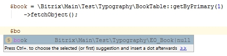
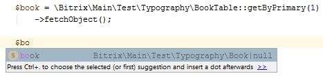

# Объекты

- [Класс](#class)
- [Именованные методы](#named)
- [Приведение типов](#type)
- [Чтение](#read) (
	[get](#read_get),
	[require](#read_runtime),
	[remindActual](#read_actual),
	[primary](#read_primary),
	[collectValues](#read_values),
	[runtime](#read_runtime)
	)
- [Запись](#write) (
	[set](#write_set),
	[reset](#write_reset),
	[unset](#write_unset)
	)
- [Создание и редактирование](#save) (
	[save](#save_save),
	[new](#save_new)
	)
- [Удаление](#delete) ([delete](#delete))
- [Восстановление](#wakeup) ([wakeup](#wakeup))
- [Заполнение](#fill) ([fill](#fill))
- [Отношения](#relations) (
	[addTo](#relations_add),
	[removeFrom](#relations_remove),
	[removeAll](#relations_remove_all)
	)
- [ArrayAccess](#arrayaccess)
 
Для начала использования объектов достаточно иметь лишь описанную сущность. Просто замените привычный `fetch` на `fetchObject` в своем коде: 

	$book = \Bitrix\Main\Test\Typography\BookTable::getByPrimary(1)
		->fetchObject();

Теперь `$book` - это полноценный объект сущности `Book`, наделенный множеством методов по манипуляции с собственными данными и отношениями с другими сущностями.

#### Класс объекта

Все объекты сущностей являются наследниками класса `Bitrix\Main\ORM\Objectify\EntityObject`, при этом у каждой сущности - свой собственный класс для объектов. По умолчанию, такой класс создается автоматически, на лету. Если вы уже сгенерировали [аннотации классов ORM](90_annotate.md), то IDE раскроет этот момент:

Как видно, класс объекта `EO_Book` находится в том же неймспейсе, что и класс Table, так же назван, но вместо суффикса `Table` имеет префикс `EO_` (аббревиатура EntityObject). Такой префикс добавлен из соображений обратной совместимости: в существующих проектах уже может быть класс `Book` или конструкция вида `use Some\Another\Book;` что приведет к конфликту повторного использования слова `Book`. Мы посчитали префикс `EO_` достаточно уникальным, тем более в обычном случае использование знака `_` противоречит [стандартам именования кода](/R&D/20_code_style/01_php.md), и конфликтов с вручную описанными классами быть не должно. 

При этом мы заложили возможность указать свое собственное, красивое имя класса, и даже разместить этот класс в другом неймспейсе при необходимости:

> bitrix/modules/main/lib/test/typography/book.php

	namespace Bitrix\Main\Test\Typography;

    class Book extends EO_Book
    {
    }

Ключевой момент - наследование от базового виртуального класса объекта `EO_Book`.

Сущность нужно уведомить о новом классе следующим образом:

> bitrix/modules/main/lib/test/typography/booktable.php

	namespace Bitrix\Main\Test\Typography;

	class BookTable extends Bitrix\Main\ORM\Data\DataManager
    {
    	public static function getObjectClass()
    	{
    		return Book::class;
    	}
    	//...
	}

Теперь метод `fetchObject` будет возвращать объекты класса `Bitrix\Main\Test\Typography\Book`. А после [перегенерации аннотаций](90_annotate.md) новый класс начнет показывать IDE:

В своем классе можно не только добавлять свой функционал, но и переопределять стандартные методы.

#### Именованные методы

Большая часть методов сделаны **именованными**. Это значит, что для каждого поля доступен набор персональных методов:

	$book->getTitle();
	$book->setTitle($value);
	$book->remindActualTitle();
	$book->resetTitle();
	// и т.д.

С полными списком методов вы ознакомитесь ниже.	

Такой подход был выбран по нескольким причинам:
 - инкапсуляция - можно контролировать доступ индивидуально к каждому полю;
 - удобство использования - не нужно помнить названия полей каждой сущности наизусть, IDE подскажет их и ускорит ввод автодополнением;
 - читаемость кода - такие записи выглядят целостно и исчерпывающе.

При этом для всех методов существует альтернатива в виде универсальных методов, принимающих имя поля в качестве одного из аргументов:

	$fieldName = 'TITLE';

	$book->get($fieldName);
	$book->set($fieldName, $value);
	$book->remindActual($fieldName);
	$book->reset($fieldName);
	// и т.д.

Такой подход удобен, когда имена полей хранятся в памяти, и вы работаете с ними обезличенно.

Если вы описали свой класс для объекта и переопределили какой-либо именованный метод, то при использовании универсального метода будет вызван ваш явно заданный именованный метод:

	namespace Bitrix\Main\Test\Typography;
    
	class Book extends EO_Book
	{
		public static function getTitle()
		{
			return 'custom title';
		}
	}
	
	$book = \Bitrix\Main\Test\Typography\BookTable::getByPrimary(1)
		->fetchObject();
	
	echo $book->getTitle(); // выведет 'custom title'
	echo $book->get('TITLE'); // тоже выведет 'custom title'

 
Внутренняя реализация именованных методов основана на magic-методе `__call` ([что это такое?](http://php.net/manual/ru/language.oop5.overloading.php#object.call)). Альтернативой могла быть кодогенерация - компиляция классов со всеми методами и их последующее кеширование. Мы сделали выбор в пользу magic по следующим причинам:

 - более низкий расход памяти по сравнению с кодогенерацией, когда системе нужно обслуживать чрезмерно громоздкие классы;
 - отпадает задача кеширования сгенерированных классов и контроль их актуальности при изменении сущности.

Минусом magic методов можно назвать увеличенный расход ресурсов процессора, но в особых случаях это можно решить явным определением часто используемых методов, как это сделано с методом `getId` в базовом классе. В то же время, такой ресурс проще всего поддается горизонтальному масштабированию, позволяя добавлять новые машины вместо бесконечного апгрейда одной существующей.

В отсутствие magic-методов и кодогенерации было бы невозможно автоматически охватить все поля из класса Table, пришлось бы описывать нужные поля и методы вручную.

#### Приведение типов

В объектах действует строгое приведение значений к типу поля. Это значит, что числа всегда будут числами, а строки - строками:

	$book = \Bitrix\Main\Test\Typography\BookTable::getByPrimary(1)
		->fetchObject();

	var_dump($book->getId());
	// выведет int 1

	var_dump($book->getTitle());
	// выведет string 'Title 1' (length=7)

Особое внимание стоит уделить типу `BooleanField`: в качестве значения ожидается true или false, несмотря на то, что фактически в базе могут храниться другие значения:

	//(new BooleanField('IS_ARCHIVED'))
	//	->configureValues('N', 'Y'),

	$book = \Bitrix\Main\Test\Typography\BookTable::getByPrimary(1)
		->fetchObject();

	var_dump($book->getIsArchived());
	// выведет boolean true

	// при установке значений тоже ожидается boolean
	$book->setIsArchived(false);

#### Чтение

###### get

Чтение данных реализовано несколькими методами. Самый простой из них возвращает значение поля либо `null` в случае его отсутствия (например, если поле не было указано в `select` при выборке):

	$book = \Bitrix\Main\Test\Typography\BookTable::getByPrimary(1)
		->fetchObject();

	$title = $book->getTitle();

###### require

Если вы уверены, что поле должно быть заполнено значением, и без этого значения продолжать выполнение сценария не имеет смысла, можете требовать это значение методом `require`:

	$book = \Bitrix\Main\Test\Typography\BookTable::getByPrimary(1)
		->fetchObject();

	$title = $book->requireTitle();

В данном случае результат `requireTitle()` не будет отличаться от вышеприведенного `getTitle()`. А следующий пример уже закончится исключением, поскольку поле не будет заполнено значением:

	$book = \Bitrix\Main\Test\Typography\BookTable::getByPrimary(1, ['select' => ['ID', 'PUBLISHER_ID', 'ISBN']])
		->fetchObject();

	$title = $book->requireTitle();
	// SystemException: "TITLE value is required for further operations"

###### remindActual

Еще один геттер `remindActual` пригодится вам при переустановке значения, чтобы отличить оригинальное значение от установленного в процессе сеанса и еще несохраненного в базу данных:

	$book = \Bitrix\Main\Test\Typography\BookTable::getByPrimary(1)
		->fetchObject();

	echo $book->getTitle();
	// выведет "Title 1"

	$book->setTitle("New title");

	echo $book->getTitle();
	// выведет "New title"

	echo $book->remindActualTitle();
	// выведет "Title 1"

В качестве альтернативы можно использовать универсальные неименованные методы:

	$fieldName = 'TITLE';

	$title = $book->get($fieldName);
	$title = $book->require($fieldName);
	$title = $book->remindActual($fieldName);

###### primary

Системный геттер `primary` реализован в виде виртуального read-only свойства, чтобы не использовать метод `getPrimary()`, резервируя тем самым имя поля `PRIMARY` с соответствующим именованным геттером. Свойство возвращает значения первичного ключа в формате массива независимо от того, составной ли первичный ключ или одиночный:

	$book = \Bitrix\Main\Test\Typography\BookTable::getByPrimary(1)
		->fetchObject();

	$primary = $book->primary;
	// вернет ['ID' => 1]

	$id = $book->getId();
	// вернет 1

###### collectValues

Метод `collectValues` используется для получения всех значений объекта в виде массива.

	$book = \Bitrix\Main\Test\Typography\BookTable::getByPrimary(1)
		->fetchObject();

	$values = $book->collectValues();
	
В данном примере вернутся все имеющиеся значения. Если для некоторых полей значения были переустановлены через сеттер, но еще не сохранены, то вернутся именно эти значения. Для неизмененных полей будут взяты актуальные значения.
 
Можно воспользоваться необязательными фильтрами, чтобы уточнить набор полей и тип данных:
 
	$book = \Bitrix\Main\Test\Typography\BookTable::getByPrimary(1)
		->fetchObject();

	$values = $book->collectValues(\Bitrix\Main\ORM\Objectify\Values::ACTUAL);
	// вернет только актуальные значения, без учета еще не сохраненных

	$values = $book->collectValues(\Bitrix\Main\ORM\Objectify\Values::CURRENT);
	// вернет только текущие значения, еще не сохраненные в базу данных

	$values = $book->collectValues(\Bitrix\Main\ORM\Objectify\Values::ALL);
	// равнозначно вызову collectValues() без параметров - сначала CURRENT, затем ACTUAL

Вторым аргументом передается маска, аналогичная используемой в [fill](#fill), определяющая типы полей:

	$book = \Bitrix\Main\Test\Typography\BookTable::getByPrimary(1)
		->fetchObject();

	$values = $book->collectValues(
		\Bitrix\Main\ORM\Objectify\Values::CURRENT,
		\Bitrix\Main\ORM\Fields\FieldTypeMask::SCALAR
	);
	// вернутся только измененные значения скалярных полей

	$values = $book->collectValues(
		\Bitrix\Main\ORM\Objectify\Values::ALL,
		\Bitrix\Main\ORM\Fields\FieldTypeMask::ALL & ~\Bitrix\Main\ORM\Fields\FieldTypeMask::USERTYPE
	);
	// вернутся значения всех полей, кроме пользовательских

###### runtime

Для `runtime` полей, создаваемых в рамках отдельных запросов, предусмотрен только универсальный геттер `get`:

	$author = \Bitrix\Main\Test\Typography\AuthorTable::query()
		->registerRuntimeField(
			new \Bitrix\Main\Entity\ExpressionField(
				'FULL_NAME', 'CONCAT(%s, " ", %s)', ['NAME', 'LAST_NAME']
			)
		)
		->addSelect('ID')
		->addSelect('FULL_NAME')
		->where('ID', 17)
		->fetchObject();

	echo $author->get('FULL_NAME');
	// выведет 'Name 17 Last name 17'

Внутри объекта такие значения хранятся изолированно от значений штатных полей, и соответственно для них неактуальны все остальные методы по работе с данными.

#### Запись

###### set

Установка значения происходит схожим образом:

	$book = \Bitrix\Main\Test\Typography\BookTable::getByPrimary(1)
		->fetchObject();

	$book->setTitle("New title");

При этом объект запоминает свои исходные значения. С этого момента доступ к текущему значению осуществляется через основной геттер `get`, а к изначальному, актуальному для базы данных значению, через вспомогательный геттер `remindActual`:

	$book->getTitle(); // текущее значение
	$book->remindActualTitle(); // актуальное для базы данных значение

Значения первичного ключа `primary` можно устанавливать только в новых объектах, в существующих изменить его будет нельзя. При такой необходимости придется создать новый объект и удалить старый. Также не сработает установка полей `Bitrix\Main\ORM\Fields\ExpressionField`, поскольку их значения расчитываются автоматически и не подлежат изменению извне.

При установке значения, не отличающегося от актуального, значение фактически не будет изменено и не попадет в SQL запрос при сохранении объекта.

###### reset

Чтобы отменить установку нового значения и вернуть исходное, можно воспользоваться вспомогательным сеттером `reset`:

	$book = \Bitrix\Main\Test\Typography\BookTable::getByPrimary(1)
		->fetchObject();

	echo $book->getTitle();
	// выведет "Title 1"

	$book->setTitle("New title");

	echo $book->getTitle();
	// выведет "New title"

	$book->resetTitle();

	echo $book->getTitle();
	// выведет "Title 1"

###### unset

Еще один вспомогательный сеттер `unset`	удалит значение объекта так, будто бы оно никогда не выбиралось из базы данных и не было установлено:

	$book = \Bitrix\Main\Test\Typography\BookTable::getByPrimary(1)
		->fetchObject();

	echo $book->getTitle();
	// выведет "Title 1"

	$book->unsetTitle();

	echo $book->getTitle();
	// null

Для сеттеров тоже есть универсальные варианты вызова с именем поля в качестве аргумента:

	$fieldName = 'TITLE';

	$book->set($fieldName, "New title");
	$book->reset($fieldName);
	$book->unset($fieldName);

Все операции по изменению значения приводят к изменениям только во время сеанса. Чтобы зафиксировать изменения в базе данных, объект нужно сохранить - об этом следующая глава.

#### Создание и редактирование

Для фиксации изменений объекта в базе данных используется метод `save`:

	$book = \Bitrix\Main\Test\Typography\BookTable::getByPrimary(1)
		->fetchObject();

	$book->setTitle("New title");

	$book->save();

> [NOTE] Если вы скопируете этот пример и попробуете выполнить его с тестовой сущностью из неймспейса `Bitrix\Main\Test\Typography`, то в силу специфики тестовых данных получите SQL ошибку. Но при этом вы увидите, что часть запроса с данными построена корректно.

С момента сохранения все текущие значения объекта преобразуются в актуальные:

	$book = \Bitrix\Main\Test\Typography\BookTable::getByPrimary(1)
		->fetchObject();

	echo $book->remindActualTitle();
	// выведет "Title 1"

	$book->setTitle("New title");

	echo $book->remindActualTitle();
	// выведет "Title 1"

	$book->save();

	echo $book->remindActualTitle();
	// выведет "New title"

Что касается новых объектов, есть два пути их создания. Наиболее читаемый способ — через прямое инстанциирование:

	$newBook = new \Bitrix\Main\Test\Typography\Book;
	$newBook->setTitle('New title');
	$newBook->save();

	$newAuthor = new \Bitrix\Main\Test\Typography\EO_Author;
	$newAuthor->setName('Some name');
	$newAuthor->save();

Способ работает как со стандартными `EO_` классами, так и с переопределенными. И даже если вы сначала использовали `EO_` класс, а потом решили создать свой, то не придется переписывать существующий код - обратная совместимость сохранится автоматически. Системный класс с префиксом `EO_` станет алиасом вашему классу. 

Более универсальный и обезличенный метод создавать новые объекты — через фабрику сущности:

	$newBook = \Bitrix\Main\Test\Typography\BookTable::getEntity()->createObject();
	$newBook->setTitle('New title');
	$newBook->save();

По умолчанию, в новом объекте устанавливаются все значения по умолчанию, описание в маппинге `getMap`. Абсолютно чистый объект можно получить, передав соответствующий аргумент в конструктор:

	$newBook = new \Bitrix\Main\Test\Typography\Book(false);
	$newBook = \Bitrix\Main\Test\Typography\BookTable::getEntity()->createObject(false);

Состояние значений меняется аналогично, как при редактировании. До сохранения объекта значения считаются текущими, после сохранения в базе данных переходят в статус `actual`.

#### Удаление

Для удаления используется метод `delete()`:

	// удаление записи
	$book = \Bitrix\Main\Test\Typography\BookTable::getByPrimary(1)
		->fetchObject();

	$book->delete();
	
	// удаление по primary ключу
	$book = \Bitrix\Main\Test\Typography\Book::wakeUp(1);

	$book->delete();

Из базы данных будет удалена только запись, соответствующая данному объекту. Если требуется удалить или предпринять иные действия с отношениями, то это нужно сделать явно. 

Как и случае удаления через одноименный метод Table-класса, в этом случае сработают все нужные [События](20_cud.md#events). Поэтому дополнительные действия можно описать в обработчике события `onDelete`.

#### Восстановление

Если у вас уже есть данные записи, для инициализации объекта необязательно выбирать их повторно из базы данных. Объект можно восстановить, имея как минимум значения первичного ключа:

	$book = \Bitrix\Main\Test\Typography\Book::wakeUp(1);

Указывать можно не только первичный ключ, но и частичный или полный набор данных:

	$book = \Bitrix\Main\Test\Typography\Book::wakeUp(['ID' => 1, 'TITLE' => 'Title 1', 'PUBLISHER_ID' => 253]);

Аналогично созданию объектов, метод актуален и для `EO_` классов, и для вызова непосредственно из `entity`:

	// свой класс
	$book = \Bitrix\Main\Test\Typography\Book::wakeUp(
		['ID' => 1, 'TITLE' => 'Title 1']
	);

	// системный класс
	$book = \Bitrix\Main\Test\Typography\EO_Author::wakeUp(
		['ID' => 1, 'TITLE' => 'Title 1']
	);

	// через фабрику entity
	$book = \Bitrix\Main\Test\Typography\BookTable::getEntity()->wakeUpObject(
		['ID' => 1, 'TITLE' => 'Title 1']
	);

В `wakeUp` можно передавать не столько скалярные значения, но и значения [Отношений](80_relations_new.md):

	$book = \Bitrix\Main\Test\Typography\Book::wakeUp([
		'ID' => 2,
		'TITLE' => 'Title 2',
		'PUBLISHER' => ['ID' => 253, 'TITLE' => 'Publisher Title 253'],
		'AUTHORS' => [
			['ID' => 17, 'NAME' => 'Name 17'],
			['ID' => 18, 'NAME' => 'Name 18']
		]
	]);

#### Заполнение

Когда в объекте заполнены не все поля, и вам нужно дозаполнить их, **не следует** применять следующий подход:

	// изначально у нас есть только ID и NAME
	$author = \Bitrix\Main\Test\Typography\EO_Author::wakeUp(
		['ID' => 17, 'NAME' => 'Name 17']
	);

	// мы хотим дозаписать LAST_NAME, довыбрав его из базы данных
	$row = \Bitrix\Main\Test\Typography\AuthorTable::getByPrimary($author->getId(),
		['select' => ['LAST_NAME']]
	)->fetch();

	// добавление значения в объект
	$author->setLastName($row['LAST_NAME']);

В таком случае значение будет считаться вновь установленным, а не актуальным, что теоретически может привести к непредсказуемым коллизиям в дальнейшей работе с объектом.

Правильно будет воспользоваться именованным методом объекта `fill`:

	// изначально у нас есть только ID и NAME
	$author = \Bitrix\Main\Test\Typography\EO_Author::wakeUp(
		['ID' => 17, 'NAME' => 'Name 17']
	);

	// добавляем LAST_NAME из базы данных
	$author->fillLastName();

Кроме именованных методов, есть и универсальный. И он предоставляет значительно больше возможностей, чем другие универсальные методы:

	$author = \Bitrix\Main\Test\Typography\EO_Author::wakeUp(17);
    
	// заполнение нескольких полей
	$author->fill(['NAME', 'LAST_NAME']);
	
	// заполнение всех незаполненных на данный момент полей
	$author->fill();

	// заполнение полей по маске, например все незаполненные скалярные поля
	$author->fill(\Bitrix\Main\ORM\Fields\FieldTypeMask::SCALAR);

	// незаполненные скалярные и пользовательские поля
	$author->fill(
		\Bitrix\Main\ORM\Fields\FieldTypeMask::SCALAR
		| \Bitrix\Main\ORM\Fields\FieldTypeMask::USERTYPE
	);

	/*
	 * Маски бывают следующие:
	 *
	 * SCALAR - скалярные поля (ORM\ScalarField)
	 * EXPRESSION - выражения (ORM\ExpressionField)
	 * USERTYPE - пользовательские поля
	 * REFERENCE - отношения 1:1 и N:1 (ORM\Fields\Relations\Reference)
	 * ONE_TO_MANY - отношения 1:N (ORM\Fields\Relations\OneToMany)
	 * MANY_TO_MANY - отношения N:M (ORM\Fields\Relations\ManyToMany)
	 *
	 * FLAT - скалярные поля и выражения
	 * RELATION - все отношения
	 *
	 * ALL - абсолютно все доступные поля
	 */

Если вам нужно дозаполнить несколько объектов, то категорически не рекомендуется выполнять эту команду в цикле - это приведет к большому количеству запросов к базе данных. Для работы с несколькими объектами одного типа одновременно следует использовать аналогичный [метод Коллекции](75_collections.md).

#### Отношения

Подробное описание отношений можно найти в соседней главе [Отношения](80_relations_new.md). Здесь же приведена спецификация управляющих отношениями методов.

Для полей отношений работают уже описанные выше методы `get`, `require`, `fill`, `reset`, `unset`.

**Важно:** несмотря на то, что в качестве значения отношений используется объект Коллекции, изменять связи можно только через методы `addTo`, `removeFrom`, `removeAll` объектов-партнеров. Изменение коллекции напрямую ([add](75_collections.md#acc_add), [remove](75_collections.md#acc_remove)) не приведет к желаемому результату.

###### addTo

Метод `addTo` добавляет новую связь между объектами:

	// инициализация издателя
	$publisher = \Bitrix\Main\Test\Typography\PublisherTable::getByPrimary(253)
		->fetchObject();
	
	// инициализация книги
	$book = \Bitrix\Main\Test\Typography\BookTable::getByPrimary(2)
		->fetchObject();
	
	// добавление книги в коллекцию отношения
	$publisher->addToBooks($book);
	
	// сохранение
	$publisher->save();

Вызов метода связывает объекты лишь в памяти, после него необходимо зафиксировать изменения методом `save`. 

###### removeFrom

Удаление отношений `removeFrom` работает похожим образом:

	// инициализация издателя
    $publisher = \Bitrix\Main\Test\Typography\PublisherTable::getByPrimary(253)
    	->fetchObject();

    // инициализация книги
    $book = \Bitrix\Main\Test\Typography\BookTable::getByPrimary(2)
    	->fetchObject();

	// удаление одной конкретной книги издателя
	$publisher->removeFromBooks($book); 

	// сохранение
	$publisher->save();

###### removeAll

Удаление сразу всех записей можно сделать одним вызовом:

	// инициализация издателя
    $publisher = \Bitrix\Main\Test\Typography\PublisherTable::getByPrimary(253)
    	->fetchObject();
    	
	// удаление одной конкретной книги издателя
	$publisher->removeAllBooks($book);
	
	// сохранение
	$publisher->save();

Для такой операции необходимо знать исходные значения - какие в данный момент есть Книги у Издателя. Поэтому, если значение поля `BOOKS` не было выбрано изначально, оно будет выбрано автоматически перед удалением.

В качестве альтернативы можно использовать универсальные неименованные методы:

	$fieldName = 'BOOKS';

	$publisher->addTo($fieldName, $book);
	$publisher->removeFrom($fieldName, $book);
	$publisher->removeAll($fieldName, $book);

#### ArrayAccess

Интерфейс доступа к объекту как к массиву может помочь обеспечить обратную совместимость при переходе с массивов на объекты:

    $author = \Bitrix\Main\Test\Typography\AuthorTable::getByPrimary(17)->fetchObject();
    		
	echo $author['NAME'];
	// вызов аналогичен методу $author->getName()
	
	$author['NAME'] = 'New name';
	// вызов аналогичен методу $author->setName('New name')

Что касается `runtime` полей, то в данном случае можно только считывать их значения, но не устанавливать:

	$author = \Bitrix\Main\Test\Typography\AuthorTable::query()
		->registerRuntimeField(
			new \Bitrix\Main\Entity\ExpressionField('FULL_NAME', 'CONCAT(%s, " ", %s)', ['NAME', 'LAST_NAME'])
		)
		->addSelect('ID')
		->addSelect('FULL_NAME')
		->where('ID', 17)
		->fetchObject();

	echo $author['FULL_NAME'];
	// вызов аналогичен методу $author->get('FULL_NAME');

	$author['FULL_NAME'] = 'New name';
	// вызовет исключение
