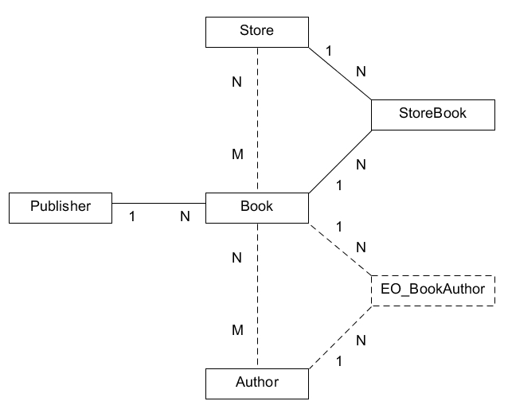

# Отношения (NEW)

- [1:N](#1n) ([Reference](#reference), [OneToMany](#onetomany))
- [1:1](#11)
- [N:M](#nm) ([простые](#manytomany), [сложные](#mediator))

На примере схемы отношений тестовых сущностей `Book`, `Author` и `Publisher` рассмотрим все комбинации и направления отношений: 1:N,  1:1, N:M.

Будем исходить из того, что книга принадлежит одному издательству, но у нее может быть несколько авторов и она продается в нескольких магазинах.

#### 1:N

В нашей тестовой вселенной книга может принадлежать и издаваться строго в одном издательстве. Получаем отношение "1 издательство - N книг".

###### Книга и издательство

В таких случаях в таблицу Книги следует добавить поле `PUBLISHER_ID`, значение которого будет указывать на Издательство.

	namespace Bitrix\Main\Test\Typography;

	use Bitrix\Main\ORM\Fields\IntegerField;

	class BookTable extends \Bitrix\Main\ORM\Data\DataManager
	{
		public static function getMap()
		{
			return [
				// ...
				(new IntegerField('PUBLISHER_ID'))
			];
		}
	}

Но для ORM одного этого поля недостаточно для понимания связи между сущностями `Book` и `Publisher`. Чтобы такое внимание возникло, используются поля множества `Bitrix\Main\ORM\Fields\Relations`, в данном случае для указания направленной связи "много к одному" нужно поле типа `Reference`:

	namespace Bitrix\Main\Test\Typography;

	use Bitrix\Main\ORM\Fields\IntegerField;
	use Bitrix\Main\ORM\Fields\Relations\Reference;
	use Bitrix\Main\ORM\Query\Join;

	class BookTable extends \Bitrix\Main\ORM\Data\DataManager
	{
		public static function getMap()
		{
			return [
				// ...
				(new IntegerField('PUBLISHER_ID')),

				(new Reference(
						'PUBLISHER',
						PublisherTable::class,
						Join::on('this.PUBLISHER_ID', 'ref.ID')
					))
					->configureJoinType('inner')
			];
		}
	}

Параметры конструктора `Reference`:

<table>
<tr>
	<th>Параметр</th>
	<th>Описание</th>
</tr>
<tr>
	<td>$name</td>
	<td>Имя поля</td>
</tr>
<tr>
	<td>$referenceEntity</td>
	<td>Класс связываемой сущности</td>
</tr>
<tr>
	<td>$referenceFilter</td>
	<td>

Условия джойна. Ожидается объект [фильтра](https://dev.1c-bitrix.ru/learning/course/index.php?COURSE_ID=43&LESSON_ID=3030&LESSON_PATH=3913.5062.5748.3030). В отличие от регулярного использования фильтра, здесь к именам колонок нужно добавлять префиксы "this." и "ref.", чтобы обозначить принадлежность к текущей и связываемой сущности соответственно.

Для читаемости создан класс `Bitrix\Main\ORM\Query\Join`, единственный метод которого `on` возвращает объект фильтра `Bitrix\Main\ORM\Query\Filter\ConditionTree`, задавая перед этим наиболее популярное условие `whereColumn`.
</td>
</tr>
</table>

Дополнительно можно сконфигурировать [тип джойна](https://stackoverflow.com/questions/6294778/mysql-quick-breakdown-of-the-types-of-joins). По умолчанию это `left join`, в примере выше задается `inner join`.

Теперь можно воспользоваться описанным отношением при выборке данных:

	$book = \Bitrix\Main\Test\Typography\BookTable::getByPrimary(1, [
		'select' => ['*', 'PUBLISHER']
	])->fetchObject();

	echo $book->getPublisher()->getTitle();
	// выведет Publisher Title 253

Доступ к объект сущности `Publisher` реализуется через геттер `getPublisher()`. Таким образом можно подключать более глубокие цепочки отношений, и так же по цепочкам геттеров добираться до конечных объектов.

Чтобы установить связь, достаточно передать объект сущности `Publisher` в соответствующий сеттер:

	// инициализация издателя
	$publisher = \Bitrix\Main\Test\Typography\PublisherTable::getEntity()
		->wakeUpObject(253);

	// инициализация книги
	$book = \Bitrix\Main\Test\Typography\BookTable::getByPrimary(1)
		->fetchObject();

	// установка значения объекта
	$book->setPublisher($publisher);
	
	// сохранение
	$book->save();

Значение поля `PUBLISHER_ID` будет заполнено автоматически из переданного объекта.

С массивами результат выглядит не так лаконично:

	$result = \Bitrix\Main\Test\Typography\BookTable::getByPrimary(1, [
		'select' => ['*', 'PUBLISHER']
	]);

	print_r($result->fetch());
	/* выведет
	Array (
		[ID] => 1
		[TITLE] => Title 1
		[PUBLISHER_ID] => 253
		[ISBN] => 978-3-16-148410-0
		[IS_ARCHIVED] => Y
		[MAIN_TEST_TYPOGRAPHY_BOOK_PUBLISHER_ID] => 253
		[MAIN_TEST_TYPOGRAPHY_BOOK_PUBLISHER_TITLE] => Publisher Title 253
	)
	*/

Полям связанной сущности присваиваются уникальные имена, основанные на неймспейсе и имени класса. Можно воспользоваться механизмом алиасов для получения более коротких и практичных имен:

	$result = \Bitrix\Main\Test\Typography\BookTable::getByPrimary(1, [
		'select' => ['*', 'PUB_' => 'PUBLISHER']
	]);

	print_r($result->fetch());
	/* выведет
	Array (
		[ID] => 1
		[TITLE] => Title 1
		[PUBLISHER_ID] => 253
		[ISBN] => 978-3-16-148410-0
		[IS_ARCHIVED] => Y
		[PUB_ID] => 253
		[PUB_TITLE] => Publisher Title 253
	)
	*/

###### Издательство и книги

Пока что доступ к отношению работает только по направлению "Книга" -> "Издатель". Чтобы сделать его двунаправленным, понадобится описать отношение на стороне сущности `Publisher`:

	namespace Bitrix\Main\Test\Typography;

	use Bitrix\Main\ORM\Data\DataManager;
	use Bitrix\Main\ORM\Fields\Relations\OneToMany;

	class PublisherTable extends DataManager
	{
		public static function getMap()
		{
			return [
				// ...

				(new OneToMany('BOOKS', BookTable::class, 'PUBLISHER'))
			];
		}
	}

Параметры конструктора `OneToMany`:

<table>
<tr>
	<th>Параметр</th>
	<th>Описание</th>
</tr>
<tr>
	<td>$name</td>
	<td>Имя поля</td>
</tr>
<tr>
	<td>$referenceEntity</td>
	<td>Класс связываемой сущности</td>
</tr>
<tr>
	<td>$referenceName</td>
	<td>Имя поля `Reference` в сущности-партнере, через которое осуществляется связь</td>
</tr>
</table>

Теперь можно воспользоваться описанным отношением при выборке данных:

	$publisher = \Bitrix\Main\Test\Typography\PublisherTable::getByPrimary(253, [
		'select' => ['*', 'BOOKS']
	])->fetchObject();

	foreach ($publisher->getBooks() as $book)
	{
		echo $book->getTitle();
	}

	// цикл выведет "Title 1" и "Title 2"

В примере выше видно принципиальное преимущество объектной модели перед массивами. Несмотря на то, что фактически выбрано две записи (для одного Издателя нашлось две книги), по факту из результата получается только один объект. Система самостоятельно распознала этот случай и склеила все книги издателя в одну [Коллекцию](75_collections.md).

Если запросить из результата массив, будет классическая структура данных с двоением данных Издателя:

	$data = \Bitrix\Main\Test\Typography\PublisherTable::getByPrimary(253, [
		'select' => ['*', 'BOOK_' => 'BOOKS']
	])->fetchAll();

	// вернет
	Array (
		[0] => Array (
			[ID] => 253
			[TITLE] => Publisher Title 253
			[BOOK_ID] => 2
			[BOOK_TITLE] => Title 2
			[BOOK_PUBLISHER_ID] => 253
			[BOOK_ISBN] => 456-1-05-586920-1
			[BOOK_IS_ARCHIVED] => N 
		) 
		[1] => Array (
			[ID] => 253
			[TITLE] => Publisher Title 253
			[BOOK_ID] => 1
			[BOOK_TITLE] => Title 1
			[BOOK_PUBLISHER_ID] => 253
			[BOOK_ISBN] => 978-3-16-148410-0
			[BOOK_IS_ARCHIVED] => Y
		)
	)

Чтобы добавить новую Книгу Издателю, используется именованный сеттер `addTo`:

	// инициализация издателя
	$publisher = \Bitrix\Main\Test\Typography\PublisherTable::getByPrimary(253)
		->fetchObject();

	// инициализация книги
	$book = \Bitrix\Main\Test\Typography\BookTable::getByPrimary(2)
		->fetchObject();
	
	// добавление книги в коллекцию отношения
	$publisher->addToBooks($book);
	
	// сохранение
	$publisher->save();

Для удаления связи со стороны книги достаточно установить `setPublisher()` другого издателя или `null`. А чтобы сделать это со стороны Издателя, существуют специализированные сеттеры `removeFrom()` и `removeAll()`:

	// инициализация книги
 	$book = \Bitrix\Main\Test\Typography\Book::wakeUp(2);

	// инициализация издателя
	$publisher = \Bitrix\Main\Test\Typography\PublisherTable::getByPrimary(253, [
		'select' => ['*', 'BOOKS']
	])->fetchObject();

	// удаление одной конкретной книги издателя
	$publisher->removeFromBooks($book);

	// или удаление всех книг издателя
	$publisher->removeAllBooks();

	// во время сохранения поле PUBLISHER_ID в Книгах будет обновлено на пустое значение
	// сами книги удалены не будут, удаляется именно связь
	$publisher->save();

**Важно** обратить внимание, что для корректной работы поле отношения должно быть заполнено - в примере выше оно указано при выборке данных. Если вы не выбирали значения из базы данных или не уверены в их заполненности у конкретного объекта, необходимо предварительно вызвать метод [fill](70_objects.md#fill):

	// инициализация книги
	$book = \Bitrix\Main\Test\Typography\BookTable::getEntity()->wakeUpObject(2);

	// у издателя будет заполнен только первичный ключ
	$publisher = \Bitrix\Main\Test\Typography\PublisherTable::getEntity()->wakeUpObject(253);

	// заполняем поле отношения
	$publisher->fillBooks();

	// удаление одной конкретной книги
	$publisher->removeFromBooks($book);

	// или удаление всех книг
	$publisher->removeAllBooks();

	// во время сохранения поле PUBLISHER_ID в Книгах будет обновлено на пустое значение
	// сами книги удалены не будут
	$publisher->save();

В случае с массивами операции `addTo`, `removeFrom` и `removeAll` невозможны, можно создать связь только со стороны сущности Книги.

#### 1:1

Отношения один-к-одному работают аналогично один-ко-многим с той лишь разницей, что в обеих сущностях вместо пары `Reference` + `OneToMany` оба поля будут `Reference`.

#### N:M

###### Примитивные отношения без вспомогательных данных

У книги может быть несколько авторов, у автора может быть несколько книг. В таких случаях создается отдельная таблица с двумя полями `AUTHOR_ID` и `BOOK_ID`. В ORM не придется оформлять ее отдельной сущностью, достаточно описать отношение специальным полем `ManyToMany`:

> bitrix/modules/main/lib/test/typography/booktable.php

	namespace Bitrix\Main\Test\Typography;

	use Bitrix\Main\ORM\Fields\Relations\ManyToMany;

	class BookTable extends \Bitrix\Main\ORM\Data\DataManager
	{
		public static function getMap()
		{
			return [
				// ...

				(new ManyToMany('AUTHORS', AuthorTable::class))
					->configureTableName('b_book_author')
			];
		}
	}

> bitrix/modules/main/lib/test/typography/authortable.php

	namespace Bitrix\Main\Test\Typography;

	use Bitrix\Main\ORM\Fields\Relations\ManyToMany;

	class AuthorTable extends \Bitrix\Main\ORM\Data\DataManager
	{
		public static function getMap()
		{
			return [
				// ...

				(new ManyToMany('BOOKS', BookTable::class))
					->configureTableName('b_book_author')
			];
		}
	}

**Необязательно описывать поле в обеих сущностях** - можно только в одной, но тогда и доступ к данным будет осуществляться только через нее.

В конструктор передаются название поля и класс партнерской сущности. В случае примитивных отношений достаточно вызвать метод `configureTableName` с указанием имени таблицы, где хранятся связующие данные. Более сложный случай будет рассмотрен ниже, в примере отношений Книг с Магазинами.

В данном же случае в памяти автоматически создается временная сущность для работы с промежуточной таблицей. Фактически вы нигде не увидите ее следов, но для понимания происходящего и возможных дополнительных настроек приоткроем внутренности. Системная сущность промежуточной таблицы имеет примерно такой вид:

	class ... extends \Bitrix\Main\ORM\Data\DataManager
	{
		public static function getTableName()
		{
			return 'b_book_author';
		}

		public static function getMap()
		{
			return [
				(new IntegerField('BOOK_ID'))
					->configurePrimary(true),

				(new Reference('BOOK', BookTable::class,
					Join::on('this.BOOK_ID', 'ref.ID')))
					->configureJoinType('inner'),

				(new IntegerField('AUTHOR_ID'))
					->configurePrimary(true),

				(new Reference('AUTHOR', AuthorTable::class,
					Join::on('this.AUTHOR_ID', 'ref.ID')))
					->configureJoinType('inner'),
			];
		}
	}

Это не более чем типовая сущность с референсами (направленными отношениями 1:N) к исходным сущностям-партнерам. Имена полей формируются на основе имен сущностей и имен их первичных ключей:

	new IntegerField('BOOK_ID') - snake_case от Book + primary поле ID
	new Reference('BOOK') - snake_case от Book
	new IntegerField('AUTHOR_ID') - snake_case от Author + primary поле ID
	new Reference('AUTHOR') - snake_case от Author

Чтобы задать имена полей явно, особенно это актуально в сущностях с составными первичными ключами для избегания путаницы, используются конфигурирующие методы:

> bitrix/modules/main/lib/test/typography/booktable.php

	namespace Bitrix\Main\Test\Typography;

	use Bitrix\Main\ORM\Fields\Relations\ManyToMany;

	class BookTable extends \Bitrix\Main\ORM\Data\DataManager
	{
		public static function getMap()
		{
			return [
				// ...

				(new ManyToMany('AUTHORS', AuthorTable::class))
					->configureTableName('b_book_author')
					->configureLocalPrimary('ID', 'MY_BOOK_ID')
					->configureLocalReference('MY_BOOK')
					->configureRemotePrimary('ID', 'MY_AUTHOR_ID')
					->configureRemoteReference('MY_AUTHOR')
			];
		}
	}

> bitrix/modules/main/lib/test/typography/authortable.php

	namespace Bitrix\Main\Test\Typography;

	use Bitrix\Main\ORM\Fields\Relations\ManyToMany;

	class AuthorTable extends \Bitrix\Main\ORM\Data\DataManager
	{
		public static function getMap()
		{
			return [
				// ...

				(new ManyToMany('BOOKS', BookTable::class))
					->configureTableName('b_book_author')
					->configureLocalPrimary('ID', 'MY_AUTHOR_ID')
					->configureLocalReference('MY_AUTHOR'),
					->configureRemotePrimary('ID', 'MY_BOOK_ID')
					->configureRemoteReference('MY_BOOK')
			];
		}
	}

Метод `configureLocalPrimary` указывает, как будет называться привязка к полю из первичного ключа текущей сущности, аналогично `configureRemotePrimary` задает соответствие полей первичного ключа сущности-партнера. Методы `configureLocalReference` и `configureRemoteReference` задают имена референсов к исходным сущностям. При описанной выше конфигурации системная сущность отношений будет иметь примерно такой вид:

	class ... extends \Bitrix\Main\ORM\Data\DataManager
	{
		public static function getTableName()
		{
			return 'b_book_author';
		}

		public static function getMap()
		{
			return [
				(new IntegerField('MY_BOOK_ID'))
					->configurePrimary(true),

				(new Reference('MY_BOOK', BookTable::class,
					Join::on('this.MY_BOOK_ID', 'ref.ID')))
					->configureJoinType('inner'),

				(new IntegerField('MY_AUTHOR_ID'))
					->configurePrimary(true),

				(new Reference('MY_AUTHOR', AuthorTable::class,
					Join::on('this.MY_AUTHOR_ID', 'ref.ID')))
					->configureJoinType('inner'),
			];
		}
	}

Чтение данных работает аналогично отношениям 1:N:

	// выборка со стороны авторов
	$author = \Bitrix\Main\Test\Typography\AuthorTable::getByPrimary(18, [
		'select' => ['*', 'BOOKS']
	])->fetchObject();

	foreach ($author->getBooks() as $book)
	{
		echo $book->getTitle();
	}
	// цикл выведет "Title 1" и "Title 2"

	// выборка со сороны книг
	$book = \Bitrix\Main\Test\Typography\BookTable::getByPrimary(2, [
		'select' => ['*', 'AUTHORS']
	])->fetchObject();

	foreach ($book->getAuthors() as $author)
	{
		echo $author->getLastName();
	}
	// цикл выведет "Last name 17" и "Last name 18"

Выборка объектов вместо массивов вновь выгодно отличается тем, что не происходит "двоения" данных, как это происходит с массивами:

	$author = \Bitrix\Main\Test\Typography\AuthorTable::getByPrimary(18, [
		'select' => ['*', 'BOOK_' => 'BOOKS']
	])->fetchAll();

	// вернет
	Array (
		[0] => Array 
			[ID] => 18
			[NAME] => Name 18
			[LAST_NAME] => Last name 18
			[BOOK_ID] => 1
			[BOOK_TITLE] => Title 1
			[BOOK_PUBLISHER_ID] => 253
			[BOOK_ISBN] => 978-3-16-148410-0
			[BOOK_IS_ARCHIVED] => Y 
		)
		[1] => Array (
			[ID] => 18
			[NAME] => Name 18
			[LAST_NAME] => Last name 18
			[BOOK_ID] => 2
			[BOOK_TITLE] => Title 2
			[BOOK_PUBLISHER_ID] => 253
			[BOOK_ISBN] => 456-1-05-586920-1
			[BOOK_IS_ARCHIVED] => N
		)
	)

Создание связи между объектами двух сущностей происходит так же, как в случае с отношениями 1:N:

	// со стороны авторов
	$author = \Bitrix\Main\Test\Typography\AuthorTable::getByPrimary(17)
		->fetchObject();

	$book = \Bitrix\Main\Test\Typography\BookTable::getByPrimary(1)
		->fetchObject();

	$author->addToBooks($book);

	$author->save();

	// со стороны книг
	$author = \Bitrix\Main\Test\Typography\AuthorTable::getByPrimary(17)
		->fetchObject();

	$book = \Bitrix\Main\Test\Typography\BookTable::getByPrimary(1)
		->fetchObject();

	$book->addToAuthors($author);

	$book->save();

Методы `removeFrom` и `removeAll` работают тоже [аналогично](#remove1N).

Для массивов подобных конструкций не предусмотрено. Как связывать сущности, используя массивы - смотрите ниже в примере отношений Книг с Магазинами.

###### Отношения со вспомогательными данными

Множество книг продается в множестве магазинов. При этом в магазине может быть какое-то определенное количество каждой из книг:

<table>
<tr>
	<th>STORE_ID</th>
	<th>BOOK_ID</th>
	<th>QUANTITY</th>
</tr>	
<tr>
	<td>33</td>
	<td>1</td>
	<td>4</td>
</tr>
<tr>
	<td>33</td>
	<td>2</td>
	<td>0</td>
</tr>
<tr>
	<td>43</td>
	<td>2</td>
	<td>9</td>
</tr>
</table>

Когда есть дополнительные данные (количество книг в наличие), а не только первичные ключи исходных сущностей, такое отношение следует описать отдельной сущностью:

	namespace Bitrix\Main\Test\Typography;

	use Bitrix\Main\ORM\Data\DataManager;
	use Bitrix\Main\ORM\Fields\IntegerField;
	use Bitrix\Main\ORM\Fields\Relations\Reference;
	use Bitrix\Main\ORM\Query\Join;

	class StoreBookTable extends DataManager
	{
		public static function getTableName()
		{
			return 'b_store_book';
		}

		public static function getMap()
		{
			return [
				(new IntegerField('STORE_ID'))
					->configurePrimary(true),

				(new Reference('STORE', StoreTable::class,
					Join::on('this.STORE_ID', 'ref.ID')))
					->configureJoinType('inner'),

				(new IntegerField('BOOK_ID'))
					->configurePrimary(true),

				(new Reference('BOOK', BookTable::class,
					Join::on('this.BOOK_ID', 'ref.ID')))
					->configureJoinType('inner'),

				(new IntegerField('QUANTITY'))
					->configureDefaultValue(0)
			];
		}
	}

Если для простых отношений без вспомогательных данных использовались поля `ManyToMany`, здесь их использование будет сильно ограничено. Можно будет создавать и удалять связи, но не будет доступа к вспомогательному полю `QUANTITY`. С помощью `removeFrom*()` можно будет удалить связь, с помощью `addTo*()` можно будет добавить связь со значением `QUANTITY` только по умолчанию, и не будет возможности обновить значение `QUANTITY`. Поэтому в таких случаях более гибким будет использование непосредственно сущности-посредника:

	// объект книги
	$book = \Bitrix\Main\Test\Typography\BookTable::getByPrimary(1)
		->fetchObject();

	// объект магазина
	$store = \Bitrix\Main\Test\Typography\StoreTable::getByPrimary(34)
		->fetchObject();

	// новый объект связи книги с магазином
	$item = \Bitrix\Main\Test\Typography\StoreBookTable::getEntity()->createObject()
		->setBook($book)
		->setStore($store)
		->setQuantity(5);

	// сохранение
	$item->save();

Обновление количества книг:

	// объект существующей связи
	$item = \Bitrix\Main\Test\Typography\StoreBookTable::getByPrimary([
		'STORE_ID' => 33, 'BOOK_ID' => 2
	])->fetchObject();

	// обновление количества
	$item->setQuantity(12);

	// сохранение
	$item->save();

Удаление связи:

	// объект существующей связи
	$item = \Bitrix\Main\Test\Typography\StoreBookTable::getByPrimary([
		'STORE_ID' => 33, 'BOOK_ID' => 2
	])->fetchObject();

	// удаление
	$item->delete();

То есть, работа с объектом связи ведется как с объектом любой другой сущности. Для массивов тоже следует использовать стандартные подходы по работе с данными:

	// добавление
	\Bitrix\Main\Test\Typography\StoreBookTable::add([
		'STORE_ID' => 34, 'BOOK_ID' => 1, 'QUANTITY' => 5
	]);

	// обновление
	\Bitrix\Main\Test\Typography\StoreBookTable::update(
		['STORE_ID' => 34, 'BOOK_ID' => 1],
		['QUANTITY' => 12]
	);

	// удаление
	\Bitrix\Main\Test\Typography\StoreBookTable::delete(
		['STORE_ID' => 34, 'BOOK_ID' => 1]
	);

Выше было упомянуто, что использовать поле `ManyToMany` в случае со вспомогательными данными - непродуктивно. Правильнее будет использовать тип `OneToMany`:

> bitrix/modules/main/lib/test/typography/booktable.php

	namespace Bitrix\Main\Test\Typography;

	use Bitrix\Main\ORM\Fields\Relations\OneToMany;

	class BookTable extends \Bitrix\Main\ORM\Data\DataManager
	{
		public static function getMap()
		{
			return [
				// ...

				(new OneToMany('STORE_ITEMS', StoreBookTable::class, 'BOOK'))
			];
		}
	}

> bitrix/modules/main/lib/test/typography/storetable.php

	namespace Bitrix\Main\Test\Typography;

	use Bitrix\Main\ORM\Fields\Relations\OneToMany;

	class StoreTable extends \Bitrix\Main\ORM\Data\DataManager
	{
		public static function getMap()
		{
			return [
				// ...

				(new OneToMany('BOOK_ITEMS', StoreBookTable::class, 'STORE'))
			];
		}
	}

В таком случае выборка ничем не будет отличаться от отношений 1:N, только в этот раз будут возвращаться объекты отношения `StoreBook`, а не сущности-партнера:

	$book = \Bitrix\Main\Test\Typography\BookTable::getByPrimary(1, [
		'select' => ['*', 'STORE_ITEMS']
	])->fetchObject();

	foreach ($book->getStoreItems() as $storeItem)
	{
		printf(
			'store "%s" has %s of book "%s"',
			$storeItem->getStoreId(), $storeItem->getQuantity(), $storeItem->getBookId()
		);
		// выведет store "33" has 4 of book "1"
	}